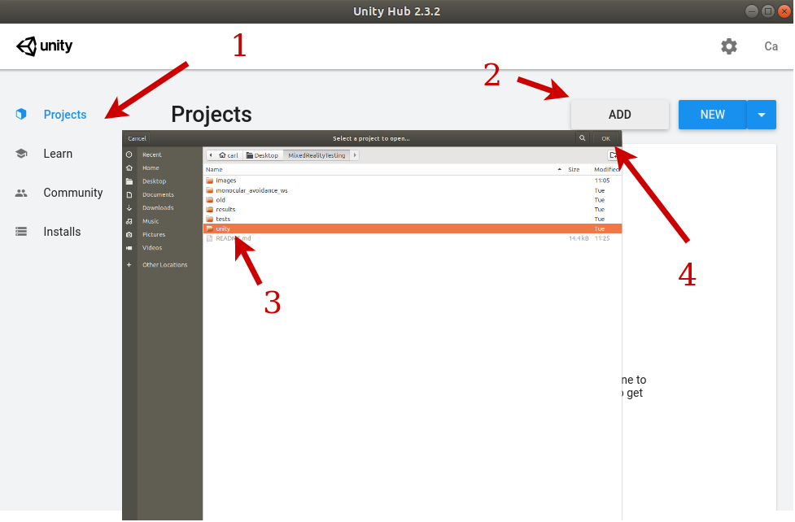

# Installation

The instalation was tested on an Ubuntu 18.04 machine with ROS melodic installed. Personally I used ZSH instead of bash and so commands have been tailored to use ZSH. However, you can easily replace these commands by changing `zsh` to `bash`. 

## Preliminary Setup

My base setup had ROS melodic installed. Starting from a clean install of Ubuntu 18.04 I ran the following commands:

```zsh
# Update
$ sudo apt-get update
$ sudo apt-get upgrade -y
$ sudo apt-get install zsh curl git fonts-powerline htop -y
$ git config --global user.email "hildebrandt.carl@outlook.com"
$ git config --global user.name "hildebrandt-carl"
$ chsh -s $(which zsh)

$ reboot

# Install ZSH
$ sh -c "$(curl -fsSL https://raw.githubusercontent.com/ohmyzsh/ohmyzsh/master/tools/install.sh)"

# Change theme to agnoster
$ nano ~/.zshrc

# restart terminal

# Install ROS
$ sudo sh -c 'echo "deb http://packages.ros.org/ros/ubuntu $(lsb_release -sc) main" > /etc/apt/sources.list.d/ros-latest.list'
$ sudo apt-key adv --keyserver 'hkp://keyserver.ubuntu.com:80' --recv-key C1CF6E31E6BADE8868B172B4F42ED6FBAB17C654
$ sudo apt update
$ sudo apt install ros-melodic-desktop-full -y
$ echo "source /opt/ros/melodic/setup.zsh" >> ~/.zshrc
$ source ~/.zshrc
$ sudo apt install python-rosdep python-rosinstall python-rosinstall-generator python-wstool build-essential -y
$ sudo rosdep init
$ rosdep update

# Add SSH Key
$ ssh-keygen -t rsa -b 4096 -C "hildebrandt.carl@outlook.com"
$ eval "$(ssh-agent -s)"
$ ssh-add ~/.ssh/id_rsa
$ sudo apt-get install xclip -y
$ xclip -sel clip < ~/.ssh/id_rsa.pub

# Paste the key into your github settings

# Install VS code
$ sudo snap install --classic code

# Download Repo
$ cd ~/Desktop
$ git clone git@github.com:hildebrandt-carl/MixedRealityTesting.git
```

## Installing Code Dependecies

### Installing Sphix

Sphinx is Parrots simulator used to simulate the Anafi. To install sphinx you need to do the following. First setup your computer to accept packages from Parrots public server:
```zsh
$ echo "deb http://plf.parrot.com/sphinx/binary `lsb_release -cs`/" | sudo tee /etc/apt/sources.list.d/sphinx.list > /dev/null
$ sudo apt-key adv --keyserver keyserver.ubuntu.com --recv-keys 508B1AE5
```

Next install the packages using:
```zsh
$ sudo apt update
$ sudo apt install parrot-sphinx -y
```


During the installation it will ask you which user groups you want to install the firmware to. To figure out what user you are you can run the command:
```zsh
$ whoami
```

You will need to reboot your system after installing `parrot-sphinx`. You can do that using:
```
$ reboot
```

Test that sphinx was install correctly by starting the Firmware you installed using:
```zsh
$ sudo systemctl start firmwared.service
$ fdc ping
>>> PONG
```

### Installing Olympe

Olympe is the library used to communicate with the Parrot Anafi. To install Olympe you need to install `repo`. To install you need to have to `repo` tool installed. To do that run the command:
```zsh
$ sudo apt-get install repo -y
```

Next we need to install the parrot-groundsdk using:
```zsh
$ cd $HOME
$ mkdir -p code/parrot-groundsdk
$ cd code/parrot-groundsdk
$ repo init -u https://github.com/Parrot-Developers/groundsdk-manifest.git
$ repo sync
```

Next you need to install all the dependencies which can be unstalled using:
```zsh 
$ cd ~/code/parrot-groundsdk
$ ./products/olympe/linux/env/postinst
```

If you get any errors about clang for example:
```zsh
E: Unable to locate package libclang-11.-dev
```

You need to run the following commands (ONLY IF YOU GOT THE ERROR ABOVE)
```zsh
# Install correct version of clang
$ sudo python3 -m pip uninstall clang -y
$ sudo python3 -m pip install clang==6.0.0.2
# Rerun the process that used to throw the error
$ cd code/parrot-groundsdk
$ ./products/olympe/linux/env/postinst
```

Next we need to build olympe. You can do that by running:
```zsh
$ cd ~/code/parrot-groundsdk
$ ./build.sh -p olympe-linux -A all final -j
```

### Goal

Right now ROS works with python2. Olympe works with python3 in a virtaul environment. We need to migrate ROS to python3, and get Olympe working outside of the virutal environement.

### Getting ROS to work with Olympe

The main problem is that ROS runs in Python2. Olympe works in Python3. Additionally Olympe was designed to work in a virtual environment. Thus we need to make Olympe accessable to the main environment as well as setup ROS to work with Python3.

First we are going to need to install a bunch of Python packages so that Olympe can work in the main path. To do that you can run the following:
```zsh
$ python3 -m pip install rospkg colorlog future aenum boltons yapf tzlocal numpy websocket websocket-client pygame EmPy
$ sudo apt install python3-opencv python-catkin-tools -y
```

Install a dependency required to build opencv
```zsh
$ pip3 install scikit-build scipy zmq matplotlib --user
```

Next we need to create the following script inside (`~/code/parrot-groundsdk`) our Olympe package. Call the file `olympe_custom_env.sh`.
```bash
#!/bin/bash


[[ $0 != $BASH_SOURCE ]] && \
	SCRIPT_PATH=$(realpath $BASH_SOURCE) || \
	SCRIPT_PATH="`readlink -f "$0"`"
GSDK_DIR="`dirname "$SCRIPT_PATH"`"

# TODO: activate your python environment here. For example:
#     source ~/code/ros_project/env/bin/activate

# The following line installs Olympe Python dependencies into your Python
# virtual environement. It should only be necessary the first time and can
# be commented out after that.
pip3 install -r "$GSDK_DIR/packages/olympe/requirements.txt"
# Add Olympe and GSDK Python dependencies to your PYTHONPATH
export PYTHONPATH="${PYTHONPATH}:/$GSDK_DIR/out/olympe-linux/final/usr/lib/python/site-packages"

# Add Olympe GSDK C dependencies to LD_LIBRARY_PATH
source "$GSDK_DIR/out/olympe-linux/final/native-wrapper.sh"
```

Then we need to source it each time we want to run olympe, by running:
```zsh
source ~/code/parrot-groundsdk/olympe_custom_env.sh
```

### ROS with Python3

Install some of the packages which are used by ROS and python3
```zsh
$ sudo apt update
$ sudo apt install python3-catkin-pkg-modules python3-rospkg-modules python3-empy python-catkin-tools python3-dev python3-catkin-pkg-modules python3-numpy python3-yaml ros-melodic-cv-bridge libgazebo9-dev libopencv-dev protobuf-compiler -y
```

Next instruct catkin build to use python 3. To do that you can run the following commands:

```zsh
$ cd ~/Desktop/MixedRealityTesting/monocular_avoidance_ws/
# Instruct catkin to set cmake variables
$ catkin config -DPYTHON_EXECUTABLE=/usr/bin/python3 -DPYTHON_INCLUDE_DIR=/usr/include/python3.6m -DPYTHON_LIBRARY=/usr/lib/x86_64-linux-gnu/libpython3.6m.so
# Instruct catkin to install built packages into install place. It is $CATKIN_WORKSPACE/install folder
$ catkin config --no-install
```

### Installing Custom Sphinx Models

Some of our sphinx simulations rely on custom object models. To make them available to sphinx we can do the following:

```
$ sudo cp ~/Desktop/MixedRealityTesting/monocular_avoidance_ws/src/drone_controller/worlds/GateModels /opt/parrot-sphinx/usr/share/sphinx/models -r
```

## Optional Installation

The following packages are optional and are not required to run the base project. I however recommend installing most of them as it will allow full functionality.

### Unity

If you want to run any of the unity simulations, you will need to install unity. To do that visit the [Unity Download Center](https://unity3d.com/get-unity/download). I would recommend downloading Unity Hub


This will download a file `UnityHub.AppImage`. Move that to your documents folder and give it execution permision. You can do that by running:

```zsh
$ cd ~/Documents
$ mv ~/Downloads/UnityHub.AppImage ./UnityHub.AppImage
$ chmod +x UnityHub.AppImage
$ ./UnityHub.AppImage
```

Next sign into unity and activate your licence.


Once you have activated your license, we need to import our project. To do that go to the `projects` tab and click add. Navigate to `~/Desktop/MixedRealityTesting/unity` and click **ok**:



Once you have added your project, you will notice an error which states that it is missing the correct unity editor. Click on the yellow warning symbol and then click install to download the correct version of the Unity Editor. Make sure to add **Linux Build Support**.


Once the Unity Editor has finished installing, open the Unity project. It will take some time to import and autogenerate the lighting.

# Running the Code

Running the code can be done by first building it and then launching the simulators and ROS code.

### Building

First we will need to build the code. To do that go into the directory and run the following commands:
```zsh
$ cd ~/Desktop/MixedRealityTesting/monocular_avoidance_ws/
$ catkin build
```

### Running

To run the code first make sure you have two terminal open. In each terminal you need to run the following code to source the ROS code as well as the Oylmpe API:
```zsh
# Terminal 1 and 2
$ cd ~/Desktop/MixedRealityTesting/monocular_avoidance_ws/
$ source devel/setup.zsh
$ source ~/code/parrot-groundsdk/olympe_custom_env.sh
```

Next we need to launch the simulator
```zsh
# Terminal 1
$ cd scripts
$ ./empty.sh
```

Finally lets launch the manual code. Make sure you have plugged in an xbox controller. And run the following code:
```zsh
$ roslaunch drone_controller manual_simulation.launch
```

**Note:** You might need to change the joystick to use js0 or js1 depending on your machine configuraiton. Look inside the 'manual_siumulation.launch' file.


---

# Old instructions


# Runnning Sphix

You can launch two drones by running:
```
$ sudo systemctl start firmwared.service
$ sphinx /opt/parrot-sphinx/usr/share/sphinx/drones/anafi4k.drone::stolen_interface=::pose="2 0 0.2 0 0 0"::with_front_cam=true /opt/parrot-sphinx/usr/share/sphinx/drones/anafi4k.drone::name=other::stolen_interface=::pose="-2 0 0.2 0 0 0"::with_front_cam=false
```

We then have a bunch of different python scripts to control the drone using:
```
$ source ~/code/parrot-groundsdk/./products/olympe/linux/env/shell
$ python <PYTHONSCRIPT>.py
```

You might find that the ethernet does not reset correctly. To reset the ethernet you can run the following:
```
$ sudo ip link set eth0 down
$ sudo ip link set eth0 name enp0s5
$ sudo ip link set enp0s5 up
```


# Flying the second drone

Create a virtual ethernet connection using:
```
$ sudo ip link add eth10 type dummy
```

Now you can launch your drone using:
```
$ sudo systemctl start firmwared.service
$ sphinx /opt/parrot-sphinx/usr/share/sphinx/drones/anafi4k.drone::stolen_interface=enp0s5:eth0:192.168.42.1/24 /opt/parrot-sphinx/usr/share/sphinx/drones/anafi4k.drone::name=other::stolen_interface=eth10:eth0:192.168.42.1/24::pose="5 0 0.2 0 0 0"::with_front_cam=false
```


## Original build instructions

These instructions do not need to be run. I have kept them if I ever need to reinstall one of the following modules

### Yolo

These were the original instructions on how I setup the darknet network.

Installation
```zsh
$ mkdir -p catkin_workspace/src
$ cd catkin_workspace/src
$ git clone --recursive git@github.com:leggedrobotics/darknet_ros.git
$ cd ../
$ catkin build darknet_ros -DCMAKE_BUILD_TYPE=Release
$ catkin build darknet_ros --no-deps --verbose --catkin-make-args run_tests
$ catkin build
```

To run it use the following:
```zsh
$ source ./devel/setup.zsh
$ roslaunch controller main.launch
```

### Making CV_Bridge work with Python3

You have to do the following. Note you need to change the catkin config command to include the python version you are using. so for example I am using python3.6.9 so I ran the command python3.6m
You also need to change the ros version to melodic in the grep command

``` zsh
# `python-catkin-tools` is needed for catkin tool
# `python3-dev` and `python3-catkin-pkg-modules` is needed to build cv_bridge
# `python3-numpy` and `python3-yaml` is cv_bridge dependencies
# `ros-kinetic-cv-bridge` is needed to install a lot of cv_bridge deps. Probaply you already have it installed.
sudo apt-get install python-catkin-tools python3-dev python3-catkin-pkg-modules python3-numpy python3-yaml ros-melodic-cv-bridge
# Create catkin workspace
mkdir catkin_workspace
cd catkin_workspace
catkin init
# Instruct catkin to set cmake variables
catkin config -DPYTHON_EXECUTABLE=/usr/bin/python3 -DPYTHON_INCLUDE_DIR=/usr/include/python3.5m -DPYTHON_LIBRARY=/usr/lib/x86_64-linux-gnu/libpython3.5m.so
# Instruct catkin to install built packages into install place. It is $CATKIN_WORKSPACE/install folder
catkin config --install
# Clone cv_bridge src
git clone https://github.com/ros-perception/vision_opencv.git src/vision_opencv
# Find version of cv_bridge in your repository
apt-cache show ros-kinetic-cv-bridge | grep Version
    Version: 1.12.8-0xenial-20180416-143935-0800
# Checkout right version in git repo. In our case it is 1.12.8
cd src/vision_opencv/
git checkout 1.12.8
cd ../../
# Build
catkin build cv_bridge
# Extend environment with new package
source install/setup.bash --extend
```

I also needed to use catkin config --no-install

## Installing CUDA

You can install Cuda using the following commands:
Add NVIDIA package repositories
```zsh
$ wget https://developer.download.nvidia.com/compute/cuda/repos/ubuntu1804/x86_64/cuda-repo-ubuntu1804_10.1.243-1_amd64.deb
$ sudo apt-key adv --fetch-keys https://developer.download.nvidia.com/compute/cuda/repos/ubuntu1804/x86_64/7fa2af80.pub
$ sudo dpkg -i cuda-repo-ubuntu1804_10.1.243-1_amd64.deb
$ sudo apt-get update
$ wget http://developer.download.nvidia.com/compute/machine-learning/repos/ubuntu1804/x86_64/nvidia-machine-learning-repo-ubuntu1804_1.0.0-1_amd64.deb
$ sudo apt install ./nvidia-machine-learning-repo-ubuntu1804_1.0.0-1_amd64.deb
$ sudo apt-get update
```

Install NVIDIA driver:
```zsh
$ sudo apt-get install --no-install-recommends nvidia-driver-430
```

Reboot. Check that GPUs are visible using the command:
```zsh
nvidia-smi
```
Install development and runtime libraries (~4GB)
```zsh
sudo apt-get install --no-install-recommends \
    cuda-10-1 \
    libcudnn7=7.6.4.38-1+cuda10.1  \
    libcudnn7-dev=7.6.4.38-1+cuda10.1
```

Install TensorRT. Requires that libcudnn7 is installed above.
```zsh
sudo apt-get install -y --no-install-recommends libnvinfer6=6.0.1-1+cuda10.1 \
    libnvinfer-dev=6.0.1-1+cuda10.1 \
    libnvinfer-plugin6=6.0.1-1+cuda10.1

```


## Setting up Vicon

Build on the vicon machine

ping from your machine then run the following commands:

Vicon Machine
```zsh
$ export ROS_IP=<VICONMACHINEIP>
$ export ROS_HOSTNAME=<VICONMACHINEIP>
$ export ROS_MASTER_URI=<YOURMACHINEIP:11311>
```

YOUR Machine
```zsh
$ export ROS_IP=<YOURMACHINEIP>
$ export ROS_HOSTNAME=<YOURMACHINEIP>
$ export ROS_MASTER_URI=http://<YOURMACHINEIP:11311>
```
